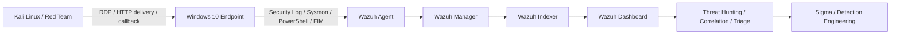

# THREAT HUNTING / DETECTION ENGINEERING

> **RDP password guessing → valid access → LOLBin transfer → PowerShell execution → TCP callback**  
> An end-to-end controlled lab focused on telemetry, correlation, detection engineering, triage, and defensive hardening.


---

## 00 / PROJECT SIGNAL

This lab was built to answer one question:

**Can a small SOC stack reconstruct an attack from independent telemetry instead of trusting isolated alerts?**

The environment combines a Kali attacker, a monitored Windows 10 endpoint, and a Wazuh server. I used the attack chain to generate evidence, validated the telemetry pipeline, built behavioral hunts, correlated events into an incident model, mapped observed behavior to MITRE ATT&CK, and converted findings into reusable Sigma detections.

### What was built

| Layer | Result |
|---|---|
| Infrastructure | 3-system lab connected over a private Tailscale overlay |
| Telemetry | Windows Security, Sysmon, PowerShell 4104, Wazuh FIM |
| Threat Hunting | 5 saved behavioral hunts |
| Detection Engineering | 3 Sigma rules + 1 RDP correlation design |
| ATT&CK coverage | 6 observed techniques |
| Response | Triage matrix, response playbook, hardening plan |

> **Investigation rule:** evidence from different validation sessions is never merged into a fake continuous timeline. The repo separates *attack proof*, *telemetry validation*, and the *correlation model*.

---

## 01 / ARCHITECTURE



Core telemetry:

- **Windows Security:** `4624`, `4625`, `4688`
- **Sysmon:** `1`, `3`, `11`, `13`
- **PowerShell Operational:** `4104 / ScriptBlockText`
- **Wazuh FIM:** file path, hash, size, add/modify/delete events

Deep dive → [`docs/architecture.md`](docs/architecture.md)

---

## 02 / ATTACK CHAIN

```text
Password Guessing
      ↓
RDP Access / Valid Account
      ↓
HTTP Delivery
      ↓
certutil.exe → C:\Users\Public\update.ps1
      ↓
PowerShell Script Block 4104
      ↓
Direct TCP Callback
```

This was an **authorized lab simulation**. The callback validation used a safe marker-based script; it did not provide a persistent remote shell.

MITRE techniques observed:

`T1110.001` · `T1021.001` · `T1078.003` · `T1105` · `T1059.001` · `T1095`

Deep dive → [`docs/attack-scenario.md`](docs/attack-scenario.md) · [`docs/mitre-mapping.md`](docs/mitre-mapping.md)

---

## 03 / THREAT HUNTING

The hunting strategy intentionally separates **behavioral hunts** from **scenario validation**. IPs, file names, and ports can change; behavior is a more durable starting point.

Five saved hunts were built in Wazuh:

1. `C3-HUNT-All-Expected-Attack-Events`
2. `C3-HUNT-RDP-Authentication`
3. `C3-HUNT-Process-Execution`
4. `C3-HUNT-File-Activity`
5. `C3-HUNT-Network-Connections`

The correlation pivots are:

`identity → process → file → network → time`

with `ProcessGuid`, `ParentProcessGuid`, `CommandLine`, `TargetFilename`, `DestinationIp`, `DestinationPort`, `LogonType`, and the attack window used to connect evidence.

Hunts → [`hunts/`](hunts/)

---

## 04 / EVIDENCE RECORDS

The public repository keeps the strongest evidence as sanitized technical records instead of dumping every screenshot from the original university report. This keeps the case study readable and avoids publishing reusable lab credentials or unrelated desktop content.

| Evidence | What it proves |
|---|---|
| [`rdp-authentication.md`](evidence/telemetry/rdp-authentication.md) | RDP password-guessing model, `4625 → 4624`, Logon Type 10 context |
| [`certutil-transfer.md`](evidence/telemetry/certutil-transfer.md) | `certutil.exe` process creation, remote URL transfer, destination in `Users\Public` |
| [`file-corroboration.md`](evidence/telemetry/file-corroboration.md) | Sysmon FileCreate + Wazuh FIM independently corroborate the same artifact |
| [`powershell-callback.md`](evidence/telemetry/powershell-callback.md) | PowerShell `4104` exposes `TcpClient` callback logic and incident marker |

The original lab report also contained screenshot evidence for the Wazuh dashboard, saved hunts, HTTP delivery, Red Team validation, process/file events, FIM and PowerShell Script Block Logging. Those screenshots are intentionally treated as supporting artifacts rather than the primary source of truth; the investigation records above preserve the event fields and conclusions used in analysis.

Evidence handling notes → [`evidence/README.md`](evidence/README.md)

---

## 05 / DETECTION ENGINEERING

The rules were derived from the investigation instead of starting from a generic rule pack.

| Detection | Data | Intent |
|---|---|---|
| Suspicious Certutil File Download from Remote URL | Process creation | Detect URL-based file transfer with `certutil.exe` |
| PowerShell Script Creates Direct TCP Client | PowerShell 4104 | Detect direct socket creation inside script blocks |
| Certutil Creates File in User-Writable Directory | Sysmon file event | Detect `certutil.exe` writing into common user-writable paths |
| Successful RDP Login After Repeated Failures | 4625 → 4624 | Correlate likely password guessing followed by successful RDP |

Sigma → [`detections/sigma/`](detections/sigma/)  
Correlation design → [`detections/rdp-correlation.md`](detections/rdp-correlation.md)

---

## 06 / TRIAGE

Final lab verdict:

| Field | Assessment |
|---|---|
| Verdict | **True Positive — Authorized Simulation** |
| Severity | **High** if reproduced on a real environment |
| Confidence | **High** for transfer / file / PowerShell evidence; **Medium** for a single continuous full-chain timeline |
| Scope | One Windows endpoint; no confirmed lateral movement or exfiltration |

The response playbook covers validation, isolation, containment, eradication, recovery, and detection improvement.

Response & hardening → [`docs/incident-response.md`](docs/incident-response.md)

---

## 07 / WHAT I LEARNED

Three lessons mattered more than the tools:

**1. An alert is not an incident.**  
`4688`, `4104`, or a FIM alert alone is weak compared with identity + process + file + network context.

**2. Missing SIEM data does not prove the event never occurred.**  
Some events existed locally but were absent from `wazuh-alerts-*` because only rule-matched events were indexed. Investigation had to fall back to endpoint and independent evidence.

**3. Behavioral detections survive lab changes better than IOC detections.**  
The attacker overlay IP changed after a rebuild. A rule hard-coded to one IP would have aged immediately; a rule based on `certutil + remote URL + user-writable path` remained useful.

Known limitations and future work → [`docs/limitations.md`](docs/limitations.md)

---

## REPOSITORY MAP

```text
.
├── README.md
├── docs/
│   ├── architecture.md
│   ├── attack-scenario.md
│   ├── investigation-timeline.md
│   ├── mitre-mapping.md
│   ├── incident-response.md
│   └── limitations.md
├── hunts/
│   ├── rdp-authentication.md
│   ├── process-execution.md
│   ├── file-activity.md
│   ├── network-connections.md
│   └── attack-correlation.md
├── detections/
│   ├── sigma/
│   │   ├── certutil-remote-download.yml
│   │   ├── powershell-direct-tcp-client.yml
│   │   └── certutil-user-writable-file.yml
│   └── rdp-correlation.md
├── configs/
└── evidence/
    └── telemetry/
```

---

### Safety / scope

All offensive actions represented here were performed against controlled lab systems for defensive validation. Public records and configuration files are sanitized; real API keys and reusable credentials are intentionally excluded.
